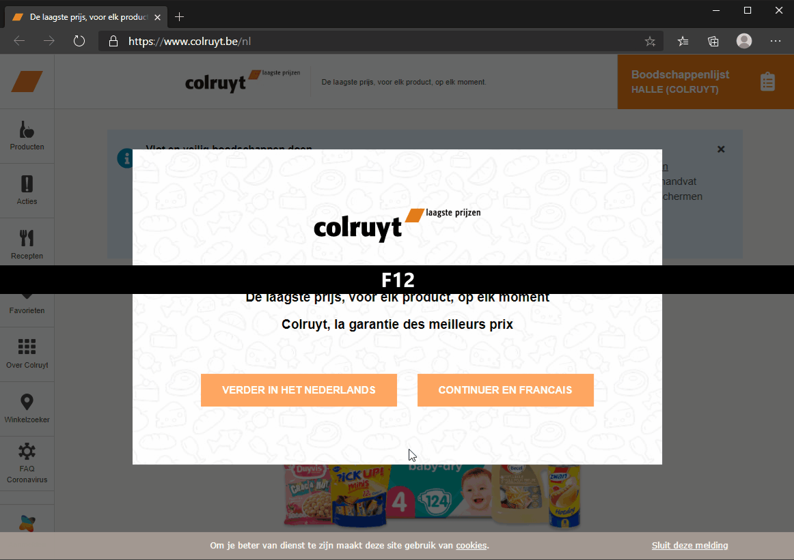
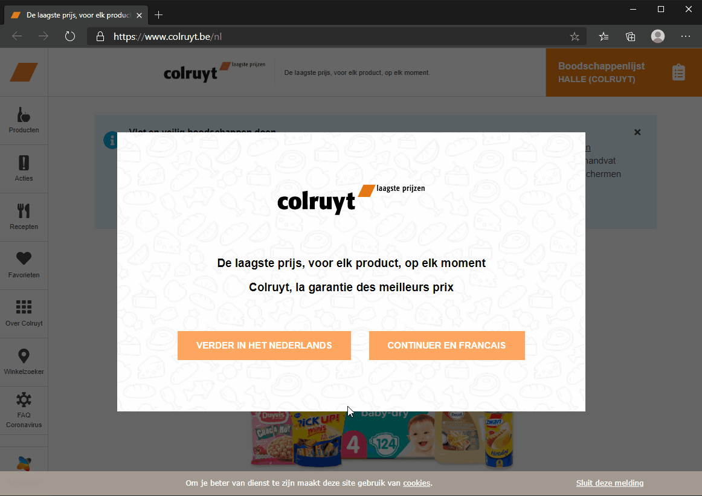

class: dark middle

# Webapplicaties II
> Hoofdstuk 5 - Webstorage
> 
---
### Introductie
# Web Storage
**Soorten**
- Cookies
- Session Storage
- Local Storage
- IndexedDB
    - Buiten de scope van deze cursus.

---
### Web Storage
# Netwerk Protocol


---
class: dark middle

# Webapplicaties I
> Hoofdstuk 5 - Webstorage

>  **Cookies**

---
### Cookies
# Overzicht
Cookies worden meestal ingesteld door een webserver. Vervolgens voegt de browser ze automatisch toe aan (bijna) **elk request** op **hetzelfde domein**.

**Cookies**
- Ingebouwde manier om kleine tekstbestanden **heen en weer te sturen**
tussen de **browser en de server**
- Servers kunnen gebruik maken van de inhoud van deze cookies om
informatie over de gebruiker bij te houden over **verschillende webpagina's** heen.

---
### Cookies
# Case
Denk aan de taal die de gebruiker op een website kiest, dit kan perfect
worden opgeslagen in een cookie. De **volgende keer** dat de gebruiker de website bezoekt, wordt de
pagina/pop-up overgeslagen waarbij de gebruiker om de gewenste taal
gevraagd wordt.

---
### Cookies
# Case


---
### Cookies
# Sequentie
1. De client vraagt aan de server de pagina op, hierbij worden **cookies** meegestuurd in de **header** van het `request`.
2. De server merkt op dat de taal nog niet gekozen is, er is namelijk **geen language cookie**.
3. De server geeft een pagina terug waarop je de taal kan kiezen.
4. De gebruiker kiest de taal en er wordt een cookie opgeslagen voor het **domein** van de website.
5. De volgende pagina die de client zal opvragen, zal de cookie meesturen waardoor de taal niet opnieuw gekozen moet worden.

> Zelfs als je de browser sluit, is de taal nog steeds gekozen aangezien de cookie nog geldig is.


---
### Cookies
# Geldigheid

Een cookie blijft bestaan, zelfs als je de tab of browser sluit. De cookie kan je verwijderen door:

- Manuele acties te nemen
    - `CTRL + SHIFT + DEL` in Chrome of Edge in te geven en **alle** cookies te verwijderen
    - `F12` - Application - Cookies en daar te zoeken naar de cookie.
- Automatisch door de browser
    - Indien de vervaldatum bereikt is.


---
### Cookies
# Structuur
Een cookie is gevormd door `key-value pairs` gescheiden door `;`

`"user=John; path=/; expires=Tue, 19 Jan 2038 03:14:07 GMT"`

Cookies hebben verschillende opties, veel daarvan zijn belangrijk en moeten worden ingesteld.

**Opties**
- [path](https://javascript.info/cookie#path)
- [domain](https://javascript.info/cookie#domain)
- [expires, max-age](https://javascript.info/cookie#expires-max-age)
- [secure](https://javascript.info/cookie#secure)
- [httpOnly](https://javascript.info/cookie#httponly)

---
### Cookies
# Client-side
We kunnen naar `document.cookie` schrijven. Maar het is geen data eigenschap, het is een `accessor (getter/setter)`.
Een schrijfoperatie naar `document.cookie` werkt alleen de cookies bij die erin worden genoemd, maar **muteert geen andere cookies**.

> Stel een cookie in met de naam `taal` en de waarde `NL`:

```js
document.cookie = 'taal=NL'
```
<button onclick="document.cookie = 'taal=NL'">Toevoegen</button>

> Verwijderen van een cookie, je zet in feite de `max-age` `1` seconde in het verleden.

```js
document.cookie = 'taal=;max-age=-1'
```
<button onclick="document.cookie = 'taal=;max-age=-1'">Verwijderen</button>

---
### Cookies
# Client-side
Om een bepaalde cookie te vinden, kunnen we `document.cookie` splitsen door `;` en dan de juiste naam vinden. We kunnen hiervoor een reguliere expressie of array-functies gebruiken.

> Geeft alle cookies terug.

```js
// returns the cookie with the given name,
// or undefined if not found
document.cookies.split("; ").forEach((part) => {
const arrPart = part.split("=");
console.log(`${arrPart[0]} --> ${arrPart[1]}`);
})
```

<button onclick="splitCookies()">Toon alle cookies in de console.</button>

---
### Cookies
# Encodering
Technisch gezien kunnen `name` en `waarde` alle karakters hebben, om de geldige opmaak te behouden (spaties) moeten ze worden `escaped` met behulp van de ingebouwde `encodeURIComponent` functie.

> Encodering van de `key-value pairs`.

```js
const name = "my name"; // let op de spatie
const value = "John Smith"

const encodedName = encodeURIComponent(name);
const encodedValue = encodeURIComponent(value);

// encodes the cookie as my%20name=John%20Smith
document.cookie = encodedName + '=' + encodedValue;

alert(document.cookie); // ...; my%20name=John%20Smith
```

<button onclick="encodeCookie()">Encodeer cookie</button>

---
### Cookies
# Caveats
- Het `naam=waarde` paar, na `encodeURIComponent`, mag niet hoger zijn dan **4kb**. We kunnen dus niets groots opslaan in een `cookie`.
- De webserver gebruikt een `Set-Cookie` header om een cookie in te stellen, waarbij de `httpOnly` waarde ingesteld wordt. Deze optie **verbiedt elke JavaScript toegang** tot de cookie. We kunnen zo'n cookie niet zien of manipuleren met behulp van `document.cookie`.
- Elke cookie wordt heen en weer gestuurd voor **elk** HTTP(s) request
- GDPR

---
### Cookies
# GDPR
Er is een wetgeving in **Europa** die **G**eneral **D**ata **P**rotection **R**egulation(GDPR) heet en die een reeks regels afdwingt voor websites om de **privacy** van de gebruikers te respecteren. En een van die regels is om een expliciete toestemming te eisen voor het traceren van cookies van een gebruiker.

> Let op, dat gaat alleen over het `traceren | identificeren | autoriseren` van cookies.

Dus, als we een cookie plaatsen die alleen wat informatie opslaat, maar de gebruiker niet traceert of identificeert, dan zijn we **vrij** om dat te doen.


---
### Cookies
# GDPR

<br/>
<br/>

<div style="border:solid 1px black;padding:1em;">
<br/>

<h1>Cookies</h1>
<p>This site uses cookies to offer you a better browsing experience. Find out more on how we use cookies and how you can change you settings.</p>
<button onclick="alert('Yeah... we know!')">I accept cookies, but this is <strong>really annoying</strong>.</button>
</div>

---
class: dark middle

# Webapplicaties I
> Hoofdstuk 5 - Webstorage

>  **Webstorage**

---
### Webstorage
# Definitie
De webstorage objecten `localStorage` en `sessionStorage` maken het mogelijk om `key/value pairs` op te slaan in de browser.

Interessant is dat de data een **pagina refresh overleeft** (`sessionStorage`) en zelfs een volledige herstart van de browser (`localStorage`).

<table width='100%'>
<tr>
    <th>Key</th>
    <th>Value</th>
</tr>
<tr>
    <td>Id</td>
    <td>1</td>
</tr>
<tr>
    <td>Name</td>
    <td>Web Applicaties 1</td>
</tr>
<tr>
    <td>Language</td>
    <td>JavaScript</td>
</tr>
</table>


---
### Webstorage
# Verschil met cookies

**Verschillen**
- Data wordt **niet** bij elk request verstuurd.
- Kan meer data stockeren, maar is **geen databank** zoals SQL.
- De **server** kan de **data niet manipuleren**, alles blijft op de client.
- **Per domein**(lees:website), de ene website kan de data van een andere dus niet muteren.
- Data is toegankelijk voor de gebruiker, bij cookies kan het zijn dat de server de cookie zet en is dus niet leesbaar door `httpOnly`

---
### Webstorage
# Session- en Localstorage

**Localstorage**
- Beschikbaarheid van data over **meerdere tabbladen/vensters** van **hetzelfde domein**.
- Data **blijft beschikbaar** als het venster, tabblad of browser sluit.

**Sessionstorage**
- Beschikbaarheid **per tabblad/venster**, wordt niet gedeeld met een ander venster of tabblad
- Data is verdwenen na het sluiten van het venster of tabblad.

---
### Webstorage
# Caveats
- Er kunnen **enkel strings** opgeslagen worden. 
> Hou hiermee rekening als er objecten of `arrays` van `objecten` opgeslagen hoeven te worden.
- De inhoud kan **door de gebruiker** **bekeken**, **gewijzigd** en **verwijderd** worden.
- **Per domein**

---
### Webstorage
# Storage Bekijken



---
### Webstorage
# Storage Muteren



---
### Webstorage
# Storage Interface

Zowel `localStorage` als `sessionStorage` implementeren de `Storage` interface en hebben dus een **gelijkaardige `API`**, die door JavaScript kan worden aangesproken. In de volgende slides kan `localStorage` vervangen worden met `sessionStorage`, maar de beschikbaarheid van de data is wel anders natuurlijk...

```ts
interface Storage {
  readonly attribute unsigned long length;
  DOMString? key(unsigned long index);
  getter DOMString? getItem(DOMString key);
  setter void setItem(DOMString key, DOMString value);
  deleter void removeItem(DOMString key);
  void clear();
};
```

---
### API
# Storage

```ts
interface Storage {
  readonly attribute unsigned long length;
  DOMString? key(unsigned long index);
  getter DOMString? getItem(DOMString key);
* setter void setItem(DOMString key, DOMString value);
  deleter void removeItem(DOMString key);
  void clear();
};
```

> Data opslaan

```js
localStorage.setItem('test', `1`);
```
Er wordt `key-value pair` toegevoegd {**'**test*'*,**'**1**'**}
 > Merk op dat beide van het type `string` zijn.

 <button onclick="localStorage.setItem('test', `1`);">Toevoegen</button>

---
### API
# Storage

```ts
interface Storage {
  readonly attribute unsigned long length;
  DOMString? key(unsigned long index);
* getter DOMString? getItem(DOMString key);
  setter void setItem(DOMString key, DOMString value);
  deleter void removeItem(DOMString key);
  void clear();
};
```

> Data ophalen

```js
alert(localStorage.getItem('test')); // 1
```

Er wordt `key-value pair` opgehaald met als sleutel **"**test**"**

 <button onclick="alert(localStorage.getItem('test'));">Ophalen</button>

---
### API
# Storage

```ts
interface Storage {
  readonly attribute unsigned long length;
  DOMString? key(unsigned long index);
  getter DOMString? getItem(DOMString key);
  setter void setItem(DOMString key, DOMString value);
* deleter void removeItem(DOMString key);
  void clear();
};
```

> Data verwijderen

```js
localStorage.removeItem('test'); 
```

Er wordt `key-value pair` opgehaald met als sleutel **"**test**"**

 <button onclick="localStorage.removeItem('test');">Verwijderen</button>

---
### API
# Storage

```ts
interface Storage {
  readonly attribute unsigned long length;
  DOMString? key(unsigned long index);
  getter DOMString? getItem(DOMString key);
  setter void setItem(DOMString key, DOMString value);
  deleter void removeItem(DOMString key);
* void clear();
};
```

> **Alle** data van dit domein verwijderen

```js
localStorage.clear(); 
```

 <button onclick="localStorage.clear();">Alles verwijderen</button>

---
### API
# Storage
**Alle** `key-value pairs` doorlopen

Als een array

```js
for(let i=0; i<localStorage.length; i++) {
  let key = localStorage.key(i);
  alert(`${key}: ${localStorage.getItem(key)}');
}
```

---
### API
# Storage
**Alle** `key-value pairs` doorlopen

Als een object

```js
for(let key in localStorage) {
  alert(key); // shows getItem, setItem and other built-in stuff
}
```
> Opgelet, hier worden ook de built-in fields teruggegeven.

Als een object **zonder built-in fields**
```js
for(let key in localStorage) {
* if (!localStorage.hasOwnProperty(key)) {
*   continue; // skip keys like "setItem", "getItem" etc
*  }
  alert(`${key}: ${localStorage.getItem(key)}');
}
```

---
### API
# Storage
**Alle** `keys` en uitprinten doorlopen

Als een object via `Object.keys` **zonder built-in fields**
```js
*let keys = Object.keys(localStorage);
for(let key of keys) {
  alert(`${key}: ${localStorage.getItem(key)}');
}
```

Via de `Object.entries` methode, `key-value pairs` doorlopen
```js
*for (let [key, value] of Object.entries(localStorage)) {
  console.log(`${key}: ${value}');
}
```

---
### Voorbeeld 
# Sticky Notes 1.0
**Structuur**
- Er wordt een sticky notes app gemaakt, waarbij je reminders kan aanmaken en bewaren.
- Er zijn 3 versies van de applicatie.
- De eerste 2 versies tonen de stickies in een `alert()`, de 3e versie is grafisch iets aangenamer.

1. Download of clone de voorbeeldbestanden via deze [link](https://github.com/Web-II/05thStorage)
```
git clone https://github.com/Web-II/05thStorage.git
```
2. Ga naar `noteToSelfV1.js`
> Vergeet niet `index.html` aan te passen per versie
```html
<script src="scripts/noteToSelf`V1.js`"></script>
```

---

```js
function init() {
  const stickiesComponent = new StickiesComponent(localStorage);
* const addButton = document.getElementById('add');
* const clearButton = document.getElementById('clear');
* const noteText = document.getElementById('notetext');

  if (!stickiesComponent.storage) {
   alert('browser ondersteunt geen storage');
   addButton.disabled = true;
   clearButton.disabled = true;
   return;
  }
* addButton.onclick = function () {
*   stickiesComponent.addSticky(noteText.value);
*   noteText.value = '';
*   stickiesComponent.toHTML();
* };
* clearButton.onclick = function () {
*   stickiesComponent.clear();
* };
}
window.onload = init;
```
- Eventhandlers toevoegen voor de knoppen
---

```js
function init() {
  const stickiesComponent = new StickiesComponent(localStorage);
  const addButton = document.getElementById('add');
  const clearButton = document.getElementById('clear');
  const noteText = document.getElementById('notetext');

* if (!stickiesComponent.storage) {
*  alert('browser ondersteunt geen storage');
*  addButton.disabled = true;
*  clearButton.disabled = true;
*  return;
* }
  addButton.onclick = function () {
    stickiesComponent.addSticky(noteText.value);
    noteText.value = '';
    stickiesComponent.toHTML();
  };
  clearButton.onclick = function () {
    stickiesComponent.clear();
  };
}
window.onload = init;
```
- Check of the browser wel toegang heeft tot de `storage`.
---

```js
function init() {
* const stickiesComponent = new StickiesComponent(localStorage);
  const addButton = document.getElementById('add');
  const clearButton = document.getElementById('clear');
  const noteText = document.getElementById('notetext');

  if (!stickiesComponent.storage) {
   alert('browser ondersteunt geen storage');
   addButton.disabled = true;
   clearButton.disabled = true;
   return;
  }
  addButton.onclick = function () {
    stickiesComponent.addSticky(noteText.value);
    noteText.value = '';
    stickiesComponent.toHTML();
  };
  clearButton.onclick = function () {
    stickiesComponent.clear();
  };
}
window.onload = init;
```
- Hier kan je ook `sessionStorage` gebruiken.
- `window.localStorage` en `localStorage` zijn equivalent.

---

```js
function init() {
  const stickiesComponent = new StickiesComponent(localStorage);
  const addButton = document.getElementById('add');
  const clearButton = document.getElementById('clear');
  const noteText = document.getElementById('notetext');

  if (!stickiesComponent.storage) {
   alert('browser ondersteunt geen storage');
   addButton.disabled = true;
   clearButton.disabled = true;
   return;
  }
  addButton.onclick = function () {
    stickiesComponent.addSticky(noteText.value);
    noteText.value = '';
    stickiesComponent.toHTML();
  };
  clearButton.onclick = function () {
    stickiesComponent.clear();
  };
}
*window.onload = init;
```
- Als het event `window.onload` getriggerd wordt door het `window` object (klaar met laden) voer dan de functie `init` uit.
---

```js
function init() {
  const stickiesComponent = new StickiesComponent(localStorage);
  const addButton = document.getElementById('add');
  const clearButton = document.getElementById('clear');
  const noteText = document.getElementById('notetext');

  if (!stickiesComponent.storage) {
   alert('browser ondersteunt geen storage');
   addButton.disabled = true;
   clearButton.disabled = true;
   return;
  }
  addButton.onclick = function () {
    stickiesComponent.addSticky(noteText.value);
    noteText.value = '';
    stickiesComponent.toHTML();
  };
  clearButton.onclick `= function ()` {
    stickiesComponent.clear();
  };
}
window.onload = init;
```
- ` = function () ...` laat `'this'` refereren naar het `HTMLelement` die het event triggered in dit geval de `clearButton`.
- **Geen arrow-functie**, `this` zou dan refereren naar het `window` object.
---

```js
class StickiesComponent {
* constructor(storage) {
* this._storage = storage;
* }
* get storage() {
*   return this._storage;
* }
  toHTML() {
    const allStickies = Object.entries(this._storage)
                              .reduce((result, [key, value]) => 
                               result += '${key}: ${value}\n`, ''');
    alert(allStickies);
  }
  [...]
}
```
- Er wordt een `getter` - `'storage'` voor `'_storage'` gedeclareerd.
Dit maakt het duidelijk dat het **niet** de bedoeling is om `'_storage'` te muteren. In JavaScript is er **geen** notie van **visibility (public | private)**. 
- Door het `storage` object als parameter mee te geven kunnen we later makkelijk **switchen** tussen `localStorage` en `sessionStorage`.
---

```js
class StickiesComponent {
  [...]
  toHTML() {
    const allStickies = `Object.entries(this._storage)`
                              .reduce((result, [key, value]) => 
                               result += '${key}: ${value}\n`, ''');
    alert(allStickies);
  }
  [...]
}
```
Geeft alle `key-value pairs` in `storage` terug.
```js
for (let [key, value] of Object.entries(localStorage)) {
  console.log(`${key}: ${value}');
}
```
---

```js
class StickiesComponent {
  [...]
  toHTML() {
    const allStickies = Object.entries(this._storage)
*                             .reduce((result, [key, value]) => 
*                              result += '${key}: ${value}\n`, ''');
    alert(allStickies);
  }
  [...]
}
```
- Alle `key-value pairs` worden `gereduceerd`/`geconcatineerd` tot **1 string** `result` die initieel leeg is `''`
- Na elke `entry` wordt er een return(enter of `\n`) geplaatst om zo de sleutel `'key'`:`'waarde'` per lijn te laten verschijnen.
- Uiteindelijk ontstaat er **1 string** genaamd `allStickes` die alle keys en waarden bevat gescheiden door een `\**n**` of **n**ewline.
---

```js
class StickiesComponent {
  constructor(storage) {
  this._storage = storage;
  }
  get storage() {
    return this._storage;
  }
  toHTML() {
    const allStickies = Object.entries(this._storage)
                              .reduce((result, [key, value]) => 
                               result += '${key}: ${value}\n`, ''');
    alert(allStickies);
  }
  clear() {
    this._storage.clear();
  }
* addSticky(note) {
*   const key = 'id-' + Math.random().toString(36).substr(2);
*   this._storage.setItem(key, note);
* }
}
```
- Genereert een 'unieke' sleutel in de vorm van `id-7zmj6qi4gq6`
- Zet de waarde in de `storage` met als key de unieke sleutel. 

---
### Voorbeeld
# Swap Storage
1. Run het voorbeeld.
2. Voeg enkele `stickies` toe.
3. Kijk na in de `localStorage` -via de browser- of er waarden werden toegevoegd.
4. Stop het voorbeeld of sluit de browser.
5. Herstart het voorbeeld of open de browser terug.
6. Kijk na in de `localStorage` via de browser of er nog waarden bestaan.
7. Pas de storage aan van `localStorage` naar `sessionStorage`.
```js
function init() {
    const stickiesComponent = new StickiesComponent(`sessionStorage`);
}
```
8. Clear|verwijder alle stickes 
9. Herhaal stap [1-6] maar kijk nu in de `sessionStorage`.
10. Merk het verschil tussen `localStorage` en `sessionStorage`.

---
### Storage
# Objects
Zoals reeds aangegeven is het enkel mogelijk om het datatype `string` op te slaan. Het datatype `Object` kan je dus niet -op deze manier- opslaan.

> Standaard wordt de `toString()` methode gebruikt, dit zorgt ervoor dat `[object Object]` als `string` wordt opgeslagen.

```js
const myObject = {name:'John', age:12, nationality:'Belgium'};

localStorage.setItem('user', myObject);
alert(localStorage.getItem('user')); // [object Object]
```

---
### Storage 
# Objects
Een mogelijke oplossing voor dit probleem zou de volgende aanpak kunnen zijn, hierdoor wordt het object wel correct opgeslagen.
```js
let user = {
  name: "John",
  age: 30,

  toString() {
    return `{name: "${this.name}", age: ${this.age}}`;
  }
};
```
> But... *"this can become a maintenance **nightmare**"*, want door het ontwikkelen worden er vaak eigenschappen toegevoegd en kan dit al snel vergeten worden.
---

### Storage
# **J**ava**S**cript **O**bject **N**otation
```js
let student = {
  name: 'John',
  age: 30,
  isAdmin: false,
  courses: ['html', 'css', 'js'],
  wife: null
};
let json = `JSON.stringify(student)`;
alert(typeof json); // we've got a string!
alert(json);
/* JSON-encoded object:
{
  "name": "John",
  "age": 30,
  "isAdmin": false,
  "courses": ["html", "css", "js"],
  "wife": null
}
```
> De methode `JSON.stringify(student)` neemt het object en zet het om in een string.

---
### Storage
# **J**ava**S**cript **O**bject **N**otation
```js
let userDataStr = '{ "name": "John", "age": 35, "friends": [0,1,2,3] }';
console.log(typeof userDataStr) // string
let user = JSON.parse(userDataStr);
alert(user.name) // John
```
> De methode `JSON.parse(userDataStr)` neemt de string en zet het om in een object.

---
### JSON
# Definitie
De `JSON` (JavaScript Object Notation) is een **algemeen formaat** om waarden en objecten weer te geven. Het wordt beschreven zoals in de RFC 4627-standaard. Aanvankelijk werd het gemaakt voor JavaScript, maar veel andere talen hebben ook bibliotheken om er mee om te gaan. Het is dus gemakkelijk om `JSON` te gebruiken voor **data-uitwisseling** als de client JavaScript gebruikt en de server geschreven is in Ruby/PHP/Java/C#/**Whatever**.

---
### JSON
# Types
- `Number` (double precision floating-point format)
- `String` (double-quoted Unicode met backslash escaping)
- `Boolean` (true or false)
- `Array` 
    - Een geordende lijst van waarden, gescheiden door komma's en omsloten door vierkante haken `[]`. De waarden moeten niet noodzakelijk van hetzelfde type zijn.
- `Object` 
    - Een ongeordende verzameling van `key-value pairs`,gescheiden door een `,` en omsloten door accolades `{}`
- `Null`

---
### JSON
# Caveats
JSON is vrij gevoelig voor subtiele typfouten, let dus goed op of gebruik een [validator](https://jsonformatter.curiousconcept.com/). 
Enkele vaak voorkomende fouten:
```js
let json = `{
   name: "John",                    // 1
  "surname": 'Smith',               // 2
  'isAdmin': false                  // 3
  "birthday": new Date(2000, 2, 3), // 4
  "friends": [0,1,2,3]              // here all fine
}`;
```
1. property name without quotes
2. single quotes in value (must be double)
3. single quotes in key (must be double) and no comma
4. no `new` is allowed, only raw values

> Meer informatie vind je [hier](https://javascript.info/json)
---

### Voorbeeld 
# Sticky Notes 2.0
1. Ga naar `noteToSelfV2.js`
> Vergeet niet `index.html` aan te passen per versie
```html
<script src="scripts/noteToSelf`V2.js`"></script>
```
2. Maak de `sessionStorage` en `localStorage` van de browser **leeg**.
3. Bekijk de code.

---
```js
class Sticky {
  constructor(note, color) {
    this._id = 'sticky_' + Math.random().toString(36).substr(2);
    this.note = note;
    this.color = color;
  }

  get id() { return this._id;}
  get note() {return this._note;}
  get color() {return this._color;}
  set note(value) {this._note = value;}
  set color(value) {this._color = value;}
}
```
- Er werd een `class` aangemaakt om een `Sticky` te encapsuleren, er werden enkele attributen toegevoegd.
    - Id
    - Note
    - Color
---

> Versie 1.0

```js
class StickiesComponent {
  [...]
  addSticky(note) {
    const key = 'id-' + Math.random().toString(36).substr(2);
    this._storage.setItem(key, note);
  }
}
```

> Versie 2.0

```js
class StickiesComponent {
  [...]
  addSticky(note`, color`) {
    `const sticky = new Sticky(note, color);`
    this._storage.setItem(`sticky.id`, `JSON.stringify(sticky)`);
  }
}
```
- Bovenaan is er versie 1 te zien, onderaan versie 2.
- In de `storage` wordt het object gezet in `string` vorm door de call naar `JSON.stringify(sticky)`

---
```js
class StickiesComponent {
  [...]
  toHTML() {
    const allStickies = 
        Object.entries(this._storage)
        .reduce((result, [key, value]) => 
        {
            // converteert JSON string naar object literal
*           const storObj = JSON.parse(value);
            // converteert object literal naar object van class Sticky
*           const sticky = new Sticky(storObj._note, storObj._color);
            return (result += '${key}:${sticky.note}-${sticky.color}\n');
            }, '');
    alert(allStickies);
  }
  [...]
}
```
- De functie is grotendeels hetzelfde gebleven, maar aangezien de `sticky` objecten als `string` worden opgeslagen in de `storage`,
hoeven deze terug naar een object geconverteerd te worden door de functie `JSON.parse(value)`. Nadien wordt van die `object literal` een `sticky` object gemaakt.

---
### Voorbeeld 
# Sticky Notes 3.0
- Wat als er ook andere informatie in de storage wordt opgeslagen en je wenst enkel de `stickies` op te halen? Daarvoor zullen we gebruik maken van een array van `stickies` en niet meer de stickies elk apart opslaan in de `storage`.
- We willen ook één sticky kunnen verwijderen en alle stickies samen kunnen verwijderen.

1. Ga naar `noteToSelfV3.js`
> Vergeet niet `index.html` aan te passen per versie
```html
<script src="scripts/noteToSelf`V3.js`"></script>
```
2. Maak de `sessionStorage` en `localStorage` van de browser **leeg**.
4. Volg het stappenplan op de volgende slide.
3. Bekijk de code.

---
### Uitwerking
# Sticky Notes 3.0
Vervolledig de code aan de hand van de volgende stappen, pas de lege functies aan door de slides **sequentieel** te volgen.
Er zijn 2 functies die je niet hoeft aan te passen:

`toHTML()` 
- Maakt voor elke sticky in de `stickies` array een listitem aan en toont deze in het `HTMLElement` `stickies`
> Meer informatie wat er in de functie juist gebeurt komt aan bod in het hoofdstuk `DOM`.

`storageEventHandler(event)` 
- Wordt automatisch opgeroepen als er in een **ander** venster of tab de **`localStorage`** werd aangepast.

---
### Sticky Notes 3.0
# addSticky(note,color)
- maakt een nieuw object van de class `Sticky` aan.
- voegt deze toe aan de nieuwe `stickies` array.
- zorgt ervoor dat de array `stickies` wordt opgeslagen in de storage met behulp van de functie `setStickiesInStorage()`.
- uiteindelijk zorgt de functie ervoor dat de `toHTML()` wordt opgeroepen om de stickies zichtbaar te maken.

> een oplossing voor deze functie vind je [hier](https://github.com/Web-II/05thStorage/commit/1ee6bbdca038371cbace80b45c9398876ad7f358?diff=split)

---
### Sticky Notes 3.0
# setStickiesInStorage()
- Persisteert  de array `stickies` in de `storage`, onder de key `stickies`.
- Er kunnen geen objecten of arrays worden opgeslagen in de `storage` dus zorg ervoor dat het `array` object `stickies` via `JSON` in de `storage` terecht komt.
- Om te kijken of er nog genoeg vrije ruimte is, kan je de volgende code gebruiken

```js
try {
    // localStorage.setItem...
} 
catch (exception) {
    if (exception == QUOTA_EXCEEDED_ERR) 
        alert('Out of storage!');
}
```

> een oplossing voor deze functie vind je [hier](https://github.com/Web-II/05thStorage/commit/c131d53e8cef671d632c5a773e80bb101b420970?diff=split)

---
### Sticky Notes 3.0
# getStickiesFromStorage()
- Haalt de key `stickies` op uit de storage (als deze bestaat).
- Nadien zal er aan de hand van de `JSON.parse()` en de `.map()` methode de array `stickies` terug opvullen met `Sticky` objecten.

> een oplossing voor deze functie vind je [hier](https://github.com/Web-II/05thStorage/commit/5d1cef5f879fbdb5e960f58248b4b68ae55e3709?diff=split)

---
### Sticky Notes 3.0
# clearStickies()
- Maakt de `stickies` array leeg.
- Verwijdert de key `stickies` uit de `storage`.
- Roept de `toHTML()` functie op.

> een oplossing voor deze functie vind je [hier](https://github.com/Web-II/05thStorage/commit/914ba18c2b5c6d60ef4665aa41f1cec68faaefbf?diff=split)

---
### Sticky Notes 3.0
# deleteSticky(key)
- Verwijdert een `Sticky` uit de `stickies` array op basis van de unieke sleutel van de `sticky`.
- Slaat wijzigen op door gebruik te maken van de functie `setStickiesInStorage()`.
- Zorgt voor een rerender door de functie `toHTML()` op te roepen.

> een oplossing voor deze functie vind je [hier](https://github.com/Web-II/05thStorage/commit/7c13b71c3d4b3e5ac3389b104017c6eba6c92f63?diff=split)

---
### Sticky Notes 3.0
# Oplossing
> een totaal oplossing voor deze oefening vind je [hier](https://github.com/Web-II/05thStorage/blob/solution-v3/scripts/notetoselfV3.js)

---
### Sticky Notes 3.0
# Arrow-function
```js
class StickiesComponent {
  [...]
    toHTML() {
    this._stickies.map(sticky => {
        [...]
      li.onclick = `() =>` {
        `this`.deleteSticky(li.id);
      };
    });
  }
  [...]
}
```
> Het `this` keyword zal hier **niet** slaan op het `<li>` element maar zal bepaald worden door de **scope** waarin de functie **gedeclareerd** werd. In dit geval slaat het op het de instantie van de klasse `StickiesComponent`.

---
### Webstorage
# Additionele Informatie
Meer informatie over `Webstorage` kan je vinden op de volgende links:
- [Cookies](https://javascript.info/cookie)
- [Local-, SessionStorage](https://javascript.info/localstorage)
- [IndexedDB](https://javascript.info/indexeddb)
> Let wel `IndexedDB` is buiten de scope van de cursus Web Applicaties II
